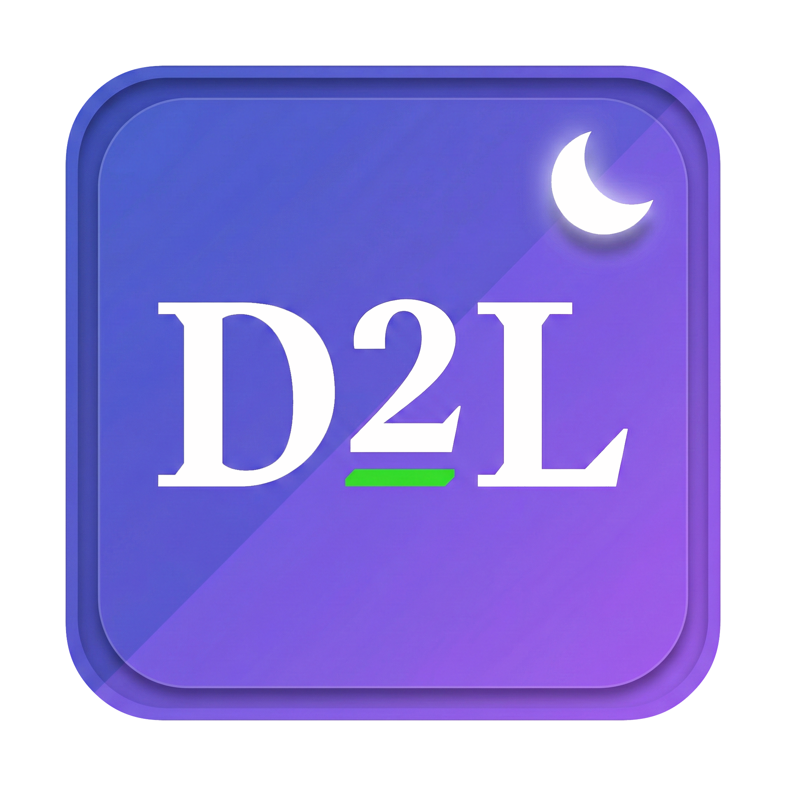

  

# DarkSpace: D2L Brightspace Dark Mode

A Chrome extension that brings dark mode to D2L Brightspace LMS. Automatically detects Brightspace pages, no setup needed.

## Features

- **Automatic detection**: DOM fingerprinting works on any Brightspace instance with no hard-coded domains
- **Shadow DOM support**: styles injected into D2L's Lit-based web components
- **Media handling**: images, videos, and canvas elements are counter-inverted to display in their original colors
- **Document dark mode**: optional toggle to darken embedded PDFs, slides, and document viewers
- **Video dark mode**: optional toggle to keep video players inverted
- **Custom domains**: add or exclude specific domains
- **Privacy-first**: zero data collection, all settings stored locally

## Installation

### From Source

1. Clone or download this repository
2. Open `chrome://extensions` in Chrome
3. Enable **Developer mode** (top-right toggle)
4. Click **Load unpacked** and select the `d2l-dark-mode/` directory

### From Chrome Web Store

*(Review in process)*

## Usage

Click the extension icon to open the popup. Controls include a power toggle, document/video dark mode switches, custom domain management, and reset to defaults.

If your institution's Brightspace isn't detected, add it via **Custom Domains** in the popup.

## How It Works

Applies `filter: invert(1) hue-rotate(180deg)` on the top-frame `<html>`, then counter-inverts media (images, video, canvas) so they display in original colors. Child frames inherit the dark appearance via parent compositing. Shadow roots receive counter-inversion rules via `adoptedStyleSheets`.

## Privacy

Zero user data collected. All preferences stored locally via `chrome.storage.sync`. See [PRIVACY.md](PRIVACY.md) for the full policy.
